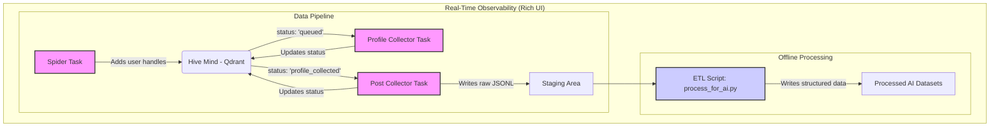

# Comprehensive Blue Sky Scraper Development Plan

## 1. Introduction

This document outlines a strategic plan for developing a powerful and scalable Blue Sky scraper. The architecture is designed as a high-throughput, asynchronous data pipeline capable of producing clean, structured, training-ready datasets for AI models.

The system will operate from a single, persistent user session, leveraging Playwright for all browser interaction, with a heavy emphasis on network request interception for speed and efficiency. A key feature is a rich, real-time command-line interface for unparalleled observability into the pipeline's status.

## 2. Core Technologies

- **Playwright**: The primary and sole tool for all data collection. It will handle logging in, session management, and data extraction by intercepting background API requests.
- **Asyncio**: The foundation for our concurrent operations, enabling us to manage multiple pipeline tasks efficiently.
- **logging (Standard Library)**: The core engine for all event logging. A custom formatter will provide color-coded, context-aware output.
- **rich**: A powerful library for creating a visually pleasing and fluid terminal interface to display live progress, status tables, and manage console output.
- **Dataclasses**: To create clean, type-safe, and self-documenting data structures for users, posts, and other entities.
- **Qdrant**: To implement the "hive mind," a centralized vector database that manages the multi-stage scraping queue with granular statuses.
- **Typer**: For creating a clean, modern command-line interface (CLI) with support for flags like `--debug`.
- **uv**: An extremely fast Python package installer and resolver, used for managing project dependencies.

## 3. Architectural Overview: An Observable Data Pipeline

The architecture is a multi-stage pipeline where independent, asynchronous tasks move user profiles through a data collection funnel. The entire process is monitored in real-time by a `rich`-powered visual interface.



- **Pipeline Tasks**: Asynchronous workers that perform a single job (e.g., find users, get profiles).
- **Hive Mind (Qdrant)**: A queue and database that tracks the state of every discovered user (`queued`, `profile_collected`, `posts_collected`).
- **Staging Area**: A "data lake" of raw, line-delimited JSON (`.jsonl`) files, ensuring original data is preserved.
- **ETL Script**: A separate, offline process for cleaning, transforming, and structuring the raw data for AI training, including media archiving.
- **Observability Layer**: A `rich` interface that provides a live view of task status, progress, and logs.

## 4. Data Models

We will use the detailed, nested dataclasses to ensure type-safe and structured data.

```python
from dataclasses import dataclass, field
from typing import List, Optional

@dataclass
class BlueSkyUser:
    handle: str
    did: str
    display_name: Optional[str] = None
    description: Optional[str] = None
    followers_count: int = 0
    following_count: int = 0
    posts_count: int = 0
    profile_picture_url: Optional[str] = None
    banner_url: Optional[str] = None
    posts: List['Post'] = field(default_factory=list)

@dataclass
class Post:
    uri: str
    cid: str
    author_did: str
    text: str
    created_at: str
    reply_count: int = 0
    repost_count: int = 0
    like_count: int = 0
    embed_images: List[str] = field(default_factory=list)
    replies: List['Post'] = field(default_factory=list)
```

## 5. Authentication and Session Workflow

The scraper will use a single account with a robust, persistent session.

1.  **Check for Session File**: On startup, the scraper looks for `session.json`.
2.  **Validate Session**: If found, it loads the session and navigates to the main feed to verify it's active.
3.  **Perform Full Login**: If the session is invalid or absent, it performs a full login using credentials.
4.  **Save Session**: On successful login, it saves the browser state to `session.json` using `context.storage_state()`.
5.  **Heartbeat Check**: During long-running operations, the scraper will periodically re-validate the session to detect logouts and trigger a re-login automatically.

## 6. Pipeline Stages & Integrated Logging

### Stage 1: User Discovery (Spider Task)
This task finds new users and adds them to the queue. It starts with a seed list of users.

- **Workflow**:
    1. Load seed users.
    2. For a user, navigate to their profile.
    3. Intercept `getFollowers` and `getFollows` API requests.
    4. Programmatically trigger follower list loading and capture the JSON responses.
    5. Check discovered handles against the Hive Mind.
- **Logging**:
    - `INFO: Starting spider task...`
    - `DEBUG: Navigating to profile of 'target_user'.`
    - `DEBUG: Intercepting follower API requests.`
    - `INFO: Discovered 50 new user handles.`
    - `INFO: Added 45 new users to the queue. 5 were duplicates.`

### Stage 2: Profile Collection (Profile Collector Task)
This task enriches user handles with detailed profile information.

- **Workflow**:
    1. Fetch a batch of users with `status: 'queued'` from the Hive Mind.
    2. For each user, navigate to their profile page.
    3. Capture the initial profile data from the main page load's JSON response.
    4. Write the raw profile data to the Staging Area.
    5. Update the user's status in the Hive Mind to `profile_collected`.
- **Logging**:
    - `INFO: Starting profile collection task...`
    - `DEBUG: Fetched 100 users for profile enrichment.`
    - `INFO: Collected profile for 'new_user_abc'.`
    - `INFO: Finished batch. Updating 100 users to 'profile_collected'.`

### Stage 3: Post Collection (Post Collector Task)
This task scrapes the entire post history for a user.

- **Workflow**:
    1. Fetch a batch of users with `status: 'profile_collected'`.
    2. For each user, navigate to their timeline.
    3. Intercept `getAuthorFeed` API requests.
    4. Programmatically scroll the page to trigger feed loading, capturing the JSON from each response.
    5. Stream the raw post data to the Staging Area.
    6. Update the user's status to `posts_collected`.
- **Logging**:
    - `INFO: Starting post collection task...`
    - `DEBUG: Starting collection for 'new_user_abc'.`
    - `DEBUG: Captured post batch 1/10 for 'new_user_abc'.`
    - `INFO: Finished collection for 'new_user_abc', found 250 posts.`
    - `INFO: Updating 'new_user_abc' to 'posts_collected'.`

## 7. Data Persistence and AI Preprocessing (ETL)

This stage is handled by a separate script (`process_for_ai.py`) to keep the pipeline focused on acquisition.

- **Staging Area**: Raw data is stored in `data/staging/` as `.jsonl` files. This is our immutable data lake.
- **ETL Script**:
    1.  **Extract**: Scans `data/staging/` for new files.
    2.  **Transform**:
        - **Text Cleaning**: Normalizes text, removes artifacts.
        - **Image Archiving**: Downloads every image URL (profile pics, banners, post embeds) and saves it to a structured path (e.g., `data/media/{user_did}/{post_cid}_{idx}.jpg`). The URL in the data is replaced with the local file path.
        - **Structuring**: Formats data for specific AI tasks (e.g., conversational threads, instruction-following datasets).
    3.  **Load**: Saves the processed, versioned data to `data/processed/v1.0/`.
- **PII Note**: As specified, this system will collect and retain all data as-is, including PII. No redaction or censorship will be performed.

## 8. Logging and Visual Interface

- **Colored Logger**: A central function in `src/core/logger_config.py` will set up a `logging.Formatter` to add ANSI color codes based on log level.
- **Rich UI (`main.py`)**:
    - A `rich.live.Live` context will manage the entire display.
    - A `rich.table.Table` will show the real-time status of each pipeline task (Spider, Profile, Post), including its status and key metrics (e.g., users found, profiles collected).
    - A `rich.progress.Progress` bar will show the overall completion of the queue.
    - `rich.logging.RichHandler` will direct all logs into the live display cleanly.
- **Debug Mode**: A `--debug` flag will set the log level to `DEBUG` for verbose output.

## 9. Project Structure

```
bluesky_scraper/
├── data/
│   ├── media/
│   ├── processed/
│   └── staging/
├── src/
│   ├── core/
│   │   ├── hive_mind.py
│   │   ├── logger_config.py
│   │   └── session_manager.py
│   ├── models/
│   │   └── models.py
│   ├── pipeline/
│   │   ├── spider_task.py
│   │   ├── profile_task.py
│   │   └── post_task.py
│   └── main.py
├── .env
├── process_for_ai.py
├── pyproject.toml
├── README.md
└── seed_users.txt
```

## 10. Development Roadmap

1.  **Environment Setup**: Initialize project with `pdm init`, install dependencies using pdm add (`playwright`, `qdrant-client`, `typer`, `rich`). Set up `.env` for credentials.
2.  **Logging & UI Shell**: Implement the colored logger and the basic `rich` layout with placeholder data.
3.  **Core Implementation**:
    - Implement the data models in `src/models/models.py`.
    - Implement `SessionManager` with login, logout, and heartbeat logic.
    - Implement `HiveMind` with functions to add/update/fetch users.
4.  **Develop Pipeline Tasks**:
    - Build the `SpiderTask`.
    - Build the `ProfileCollectorTask`.
    - Build the `PostCollectorTask`.
    - Integrate all tasks into `main.py`, orchestrating their execution with `asyncio`.
5.  **Develop ETL Script**: Build `process_for_ai.py` with logic for cleaning data and archiving media.
6.  **Testing and Refinement**: Thoroughly test the end-to-end pipeline and refine the UI and logging for clarity.
---

## 11. API Data Elements

This section outlines the specific data elements to be scraped from Blue Sky's public API, based on analysis of network traffic. This approach supersedes HTML scraping and relies on intercepting network requests to capture clean JSON data.

### 11.1. User Profile

This data is retrieved from the `https://public.api.bsky.app/xrpc/app.bsky.actor.getProfile` endpoint.

| Data Element | JSON Key | Example |
| :--- | :--- | :--- |
| **DID** | `did` | `did:plc:udnac33pmf2iwcblpeai5a5p` |
| **Handle** | `handle` | `iwillnotbesilenced.bsky.social` |
| **Display Name** | `displayName` | `Raider` |
| **Description** | `description` | `FASCISM IS NOT TO BE DEBATED...` |
| **Avatar URL** | `avatar` | `https://cdn.bsky.app/...` |
| **Banner URL** | `banner` | `https://cdn.bsky.app/...` |
| **Followers Count** | `followersCount` | `41492` |
| **Following Count** | `followsCount` | `12317` |
| **Posts Count** | `postsCount` | `9030` |
| **Pinned Post URI** | `pinnedPost.uri` | `at://did:plc:udnac33...` |

### 11.2. Following List

This data is retrieved from the `https://public.api.bsky.app/xrpc/app.bsky.graph.getFollows` endpoint. The response contains a `follows` array, and the following keys should be extracted for each user object in the array.

| Data Element | JSON Key | Example |
| :--- | :--- | :--- |
| **DID** | `did` | `did:plc:2mph3xlusws6dl6fqr2gbyjg` |
| **Handle** | `handle` | `tenderlee.bsky.social` |
| **Display Name** | `displayName` | `Michele` |
| **Description** | `description` | `Here for politics. TN Blue voter...` |
| **Avatar URL** | `avatar` | `https://cdn.bsky.app/...` |

### 11.3. User Feed (Posts)

This data is retrieved from the `https://public.api.bsky.app/xrpc/app.bsky.feed.getAuthorFeed` endpoint. The response contains a `feed` array, and the following keys should be extracted for each `post` object.

| Data Element | JSON Key | Example |
| :--- | :--- | :--- |
| **Post URI** | `post.uri` | `at://did:plc:udnac33.../3ltad2l3cic2h` |
| **Post CID** | `post.cid` | `bafyreihortbkkuzkxxx2hlc4vg6ikzzlia2lqz5jkr7y5hhpf4gw4m3lhi` |
| **Post Text** | `post.record.text` | `Yesterday in LA. the LAPD chased & brutalized...` |
| **Created At** | `post.record.createdAt` | `2025-07-05T17:51:03.020Z` |
| **Reply Count** | `post.replyCount` | `68` |
| **Repost Count**| `post.repostCount` | `215` |
| **Like Count** | `post.likeCount` | `372` |
| **Quote Count** | `post.quoteCount` | `24` |
| **Embed Type** | `post.embed.$type` | `app.bsky.embed.video#view` |
| **Embed Image/Video**| `post.embed.images` or `post.embed.video` | (Contains URLs and metadata) |